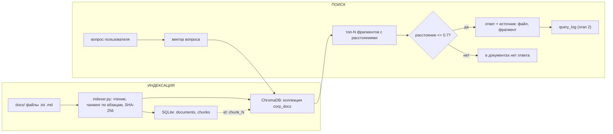

# Архитектура RAG-системы

Документ описывает текущую архитектуру системы (этап 1) и планируемые компоненты (этап 2).
Ведётся параллельно с кодом: при изменении компонентов обновляется и этот файл.

## 1. Назначение

Система выполняет семантический поиск по корпусу корпоративных документов:
на вопрос пользователя возвращает релевантные фрагменты с указанием источника
(файл, номер фрагмента) и оценкой уверенности (расстояние). Генерация ответов
средствами LLM будет добавлена на этапе 2.

## 2. Состав компонентов

| Компонент | Файл / расположение | Ответственность |
|---|---|---|
| Модуль индексации | `indexer.py` | файл → текст → чанки → запись в SQLite и ChromaDB под общими id |
| Хранилище метаданных | `data/metadata.db` (SQLite), схема `sql/schema.sql` | таблицы `documents`, `chunks`, `query_log` |
| Векторное хранилище | `data/chroma` (ChromaDB), коллекция `corp_docs` | векторы и тексты чанков, поиск ближайших по смыслу |
| Модуль поиска | `search_with_sources.py` | вопрос → топ-N фрагментов с расстояниями, пороговая отсечка, указание источника |
| (план) Модуль генерации | этап 2 | локальная LLM (Ollama): ответ строго по найденному контексту |
| (план) API и веб-интерфейс | этап 2 | FastAPI, Streamlit |

## 3. Потоки данных

### Индексация
1. `indexer.py` читает файл из `docs/` (форматы .txt, .md).
2. Считается SHA-256 отпечаток текста: без изменений → пропуск; изменился → старая версия удаляется из обеих баз.
3. Документ регистрируется в SQLite (`documents`), текст режется на чанки по абзацам.
4. Чанки вставляются в SQLite (`chunks`), получают id.
5. Те же чанки уходят в ChromaDB под id `chunk_<id из SQLite>` с метаданными (`document_id`, `chunk_index`, `title`).

### Поиск
1. Вопрос векторизуется той же моделью, что и документы.
2. ChromaDB возвращает топ-N ближайших чанков с расстояниями.
3. Расстояние > порога 0.7 → результат отбрасывается; все отброшены → ответ «в документах нет ответа».
4. По метаданным `document_id` в SQLite подтягивается имя файла-источника.
5. (план, этап 2) вопрос и принятые фрагменты передаются LLM; ответ и факт обращения journal-ируются в `query_log`.

## 4. Ключевые проектные решения и их обоснование

1. **Чанкинг по абзацам** (пустая строка — граница; абзацы длиннее 600 символов дочитываются символами с перекрытием 100).
   Обоснование: эксперимент показал, что символьная нарезка рвёт смысл и сжимает все расстояния в полосу 0.84–0.90 (нет контраста между ответами и ловушками); после перехода на абзацы ответы ~0.49, ловушки ~0.75 и выше.
2. **Связка id SQLite ↔ ChromaDB** (`chunk_<id>` + метаданные).
   Обоснование: позволяет в результатах поиска называть источник (файл, номер фрагмента) — требование «ссылки на первоисточники».
3. **SHA-256 отпечаток документа.**
   Обоснование: идемпотентность индексации (повторный прогон не создаёт дублей) и корректная переиндексация изменённых файлов.
4. **Порог отсечения 0.7.**
   Обоснование: подобран эмпирически (замеры от 09.10.2026): уверенные ответы ~0.49, вопросы без точного ответа, но тематически близкие ~0.52–0.57, ловушки ~0.75 и выше. Порог отделяет ловушки; средняя зона пропускается осознанно — её обработку возьмёт на себя LLM-модуль этапа 2 («отвечай только по контексту»). При расширении корпуса порог перепроверять.
5. **SQLite в прототипе, SQL Server/PostgreSQL в сетевой версии.**
   Обоснование: схема (`sql/schema.sql`) не зависит от СУБД; SQLite не требует настройки для локального контура.
6. **Модель эмбеддингов `paraphrase-multilingual-MiniLM-L12-v2`.**
   Обоснование: поддержка русского языка, локальный запуск без внешних сервисов.

## 5. Варианты развёртывания

- **Локальный (реализуется):** все компоненты на одной машине, данные в папке `data/`; запуск: `init_db.py` → `indexer.py docs` → `search_with_sources.py`; на этапе 2 упаковывается в Docker Compose.
- **Сетевой (план, этап 2):** сервер (FastAPI + SQLite/SQL Server + ChromaDB + Ollama) в контуре предприятия; клиенты обращаются через веб-интерфейс. Данные не покидают периметр.

## 6. Ограничения и направления развития

- Форматы: пока .txt и .md; парсинг PDF/DOCX — в развитии.
- Поиск без генерации: система возвращает фрагменты, а не сформулированный ответ (LLM — этап 2).
- Нет гибридного поиска (BM25) и re-ranking — этап 2; кейс «сколько дней будет отпуск?» (см. `docs/test_cases.md`) показывает, что чисто векторный поиск уступает там, где важны точные термины.
- Эмпирический порог требует перепроверки при росте корпуса; полноценная оценка — тестовый датасет и метрики RAGAS (этап 2).

## 7. Схема компонентов

